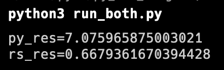
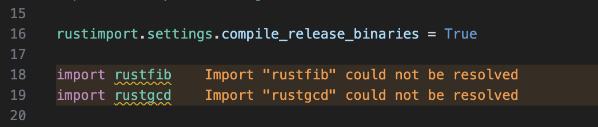
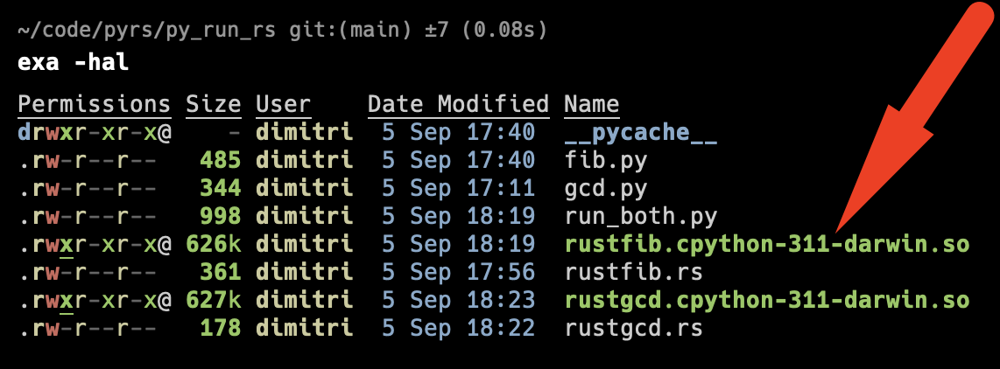

[//]: # " cspell:ignore numpy, numba, cudf "

# pyrs

Python (py) + Rust (rs)

This is a learning repo for experimenting with Python and Rust interoperability.

## philosophical note

I really enjoy how easy Python is for rapid prototyping. And when the prototype
is built, then revising and optimizing can be a real pleasure too.
Some optimizations are "freebie" changes, such as using [Numpy](https://numpy.org/) for
vectorized operations, JIT compilation with [Numba](https://numba.pydata.org/),
swapping [cuDF](https://docs.rapids.ai/api/cudf) in place of
[Pandas](https://pandas.pydata.org/), etc. I have also experienced the "ease"
of optimizing that code by writing custom modules in C/C++.

But I have heard a lot about Rust lately, and I am curious to see how
well it can play with Python. I am also curious to see how much of a speedup
I can get by using Rust.

Last note: when refactoring Python prototypes, I find that success is really
dependent on how well the code is structured. Highly modular code with
clearly defined interfaces tends to be _much_ easier to refactor than
spaghetti code. Especially when doing cross-language refactoring, such as
migrating high-cost code from Python to any other language.

## py_run_rs: using Python to call Rust code

Folder `py_run_rs` contains Rust code that can be called from Python.

I am following [this writeup](https://pythonspeed.com/articles/easiest-rust-python/)
to get started with Python and Rust interoperability.

This is basically the same "speed up Python" method as the classic
"write a custom module in C/C++" method, but using Rust instead.

And [rustimport](https://github.com/mityax/rustimport) makes it easy. Very easy.
Like "I can't believe it's not butter" easy. Even on-demand compiling when the
script is first run. Wow.

The result is a 10.6x speedup for the Fibonacci + GCD function combo -- not bad.

Note: rather standard VS-Code Python extension settings will be unhappy with
importing a `.so` file.

This happens despite the `.so` files being in the CWD and the Python code
itself imports them & runs them just fine.

There are multiple methods to fix this behavior, such as adjusting the Python Path,
adding a `.env` file, editing the VS-Code Pylance settings, etc. And I am not
demo'ing that here. :wink:
