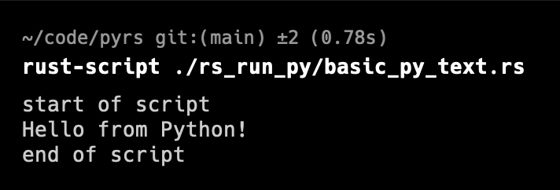

[//]: # " cspell:ignore numpy, numba, cudf "

# pyrs

Python (py) + Rust (rs)

This is a learning repo for experimenting with Python and Rust interoperability.

## philosophical note

I really enjoy how easy Python is for rapid prototyping. And when the prototype
is built, then revising and optimizing can be a real pleasure too.
Some optimizations are "freebie" changes, such as using [Numpy](https://numpy.org/) for
vectorized operations, JIT compilation with [Numba](https://numba.pydata.org/),
swapping [cuDF](https://docs.rapids.ai/api/cudf) in place of
[Pandas](https://pandas.pydata.org/), etc. I have also experienced the "ease"
of optimizing that code by writing custom modules in C/C++.

But I have heard a lot about Rust lately, and I am curious to see how
well it can play with Python. I am also curious to see how much of a speedup
I can get by using Rust.

Last note: when refactoring Python prototypes, I find that success is really
dependent on how well the code is structured. Highly modular code with
clearly defined interfaces tends to be _much_ easier to refactor than
spaghetti code. Especially when doing cross-language refactoring, such as
migrating high-cost code from Python to any other language.

## py_run_rs: using Python to call Rust code

Folder `py_run_rs` contains Rust code that can be called from Python.

I am following [this writeup](https://pythonspeed.com/articles/easiest-rust-python/)
to get started with Python and Rust interoperability.

This is basically the same "speed up Python" method as the classic
"write a custom module in C/C++" method, but using Rust instead.

And [rustimport](https://github.com/mityax/rustimport) makes it easy. Very easy.
Like "I can't believe it's not butter" easy. Even on-demand compiling when the
script is first run. Wow.

The result is a 10.6x speedup for the Fibonacci + GCD function combo -- not bad.


Note: rather standard VS-Code Python extension settings will be unhappy with
importing a `.so` file. Many of us just install the default Python extension,
which uses fairly standard Pylance configs. And that config is not happy.


This happens despite the `.so` files being in the CWD and the Python code
itself imports them & runs them just fine.


There are multiple methods to fix this behavior, such as adjusting the Python Path,
adding a `.env` file, editing the VS-Code Pylance settings, etc. And I am not
demo'ing that here. :wink:

### run py_run_rs

To run this code, first install Rust and Cargo per instructions at
[rustup](https://rustup.rs/).

Then install `rustimport`:

```bash
pip3 install rustimport
```

After that, you can `cd` into the `py_run_rs` directory and run the Python script:

```bash
python3 run_both.py
```

## rs_run_py: using Rust to interpret Python code

Folder `rs_run_py` contains Python code that is embedded inside Rust via
[rustpython](https://rustpython.github.io/). A few years ago, I tried
achieving this via PyO3, but that was not a pleasant experience. My apologies
to the PyO3 team. I am sure it has improved since then, but I'm giving
rustpython a try.

Of note: at the time I am writing this, rustpython is at v0.2.0, so it might
not be fully stable & ready for production. However, there are already some
rather cool projects using it, as listed on the
[rustpython github page](https://github.com/RustPython/RustPython#use-cases).

Installation of rustpython is described on the
[rustpython github page](https://github.com/RustPython/RustPython/tree/main).
At the time of writing this, the installation is:

```bash
cargo install --git https://github.com/RustPython/RustPython
```

Of note: this command takes a minute. There are a lot of packages to be downloaded,
compiled, voodoo magic to be performed, etc. So be patient.

Since I'm messing with a bunch of stuff and this is just a learning/demo repo,
the file `rs_run_py/basic_py_text.rs` is a [rust-scripts](https://rust-script.org/)
and can be run directly from the command line:

```bash
rust-script ./rs_run_py/basic_py_text.rs
```


